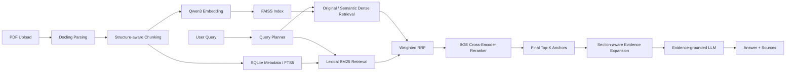

<div align="center">

# 📚 PaperBase

### 面向学术论文的 RAG 知识库与 AI 阅读辅助系统

**Scientific PDF Parsing · Hybrid Retrieval · Reranking · Evidence Expansion · Grounded QA · Evaluation**

<br/>


<br/>

[项目简介](#-项目简介) ·
[核心能力](#-核心能力) ·
[系统架构](#-系统架构) ·
[评测结果](#-评测结果) ·
[快速开始](#-快速开始) ·
[项目结构](#-项目结构) ·
[Roadmap](#-roadmap)

</div>

---

## ✨ 项目简介

**PaperBase** 是一个面向学术论文场景构建的 RAG 应用，覆盖从论文解析、结构化切片、索引构建，到混合检索、重排序、证据扩展和基于证据的答案生成的完整链路。

除了知识库问答，PaperBase 还提供 **Paper Overview、Explain Section、Ask This Paper** 等论文阅读辅助能力，并构建了独立的 **Golden Dataset + Retrieval Evaluation Pipeline**，用于持续评估检索效果、定位失败阶段和验证系统优化是否有效。

> **项目目标：** 不只是“让 RAG 跑起来”，而是构建一套能够被测试、分析、解释和持续优化的论文知识库系统。

<!--
如需展示 UI，可将截图放入 docs/assets/ 后取消下面注释。

<p align="center">
  
  
</p>
-->

---

## 🌟 核心能力

| 能力 | 实现 |
|---|---|
| **Scientific PDF Parsing** | 基于 **Docling** 解析论文标题、作者、章节结构、正文、表格与参考文献 |
| **Structure-aware Chunking** | 根据 Section Tree 与语义边界切片，并保留 `paper_id / section / page` 等 metadata |
| **Hybrid Retrieval** | **Qwen3 Embedding + FAISS** 负责语义召回，**SQLite FTS5 / BM25** 补充术语和关键词召回 |
| **Query Enrichment** | LLM Semantic Rewrite + Deterministic Lexical Extraction，多路检索同时保留原始 Query |
| **Weighted RRF** | 使用加权 Reciprocal Rank Fusion 融合 Dense / Sparse 多路候选 |
| **Cross-Encoder Reranking** | 使用 **BAAI/bge-reranker-v2-m3** 对候选 Evidence 精排 |
| **Evidence Expansion** | 对 Final Top-K anchors 做 section-aware 上下文扩展，缓解 Chunk Fragmentation |
| **Bibliography-aware Retrieval** | 正文与 References 分离管理，仅在 Bibliography Intent 下触发参考文献检索 |
| **Evidence-grounded QA** | LLM 仅基于检索 Evidence 生成回答，并保留来源证据 |
| **Paper Reading Workspace** | 支持 **Overview / Explain Section / Ask This Paper** 等论文阅读辅助功能 |
| **Evaluation Pipeline** | Golden Dataset、Stage Comparison、Slice Evaluation、Query Planner Audit、Expansion-aware Evaluation |

---

## 🧠 系统架构



### Retrieval Pipeline

```text
User Query
   │
   ├── Original Query
   │     └── Qwen3 Embedding → FAISS
   │
   └── Query Planner
         ├── Semantic Query → Dense Retrieval
         └── Lexical Terms  → SQLite FTS5 / BM25
                         │
                         ▼
                  Weighted RRF
                         │
                         ▼
                Candidate Top-K
                         │
                         ▼
              BGE Cross-Encoder
                         │
                         ▼
                  Final Top-5
                         │
                         ▼
             Evidence Expansion
                         │
                         ▼
                Answer Generation
```

正文、Bibliography 与论文 Metadata 分开管理。普通问题主要在正文索引中检索；只有在识别到参考文献查询意图时，才额外进入 Bibliography Retrieval。

---

## 🛠️ 技术栈

| Layer | Technology |
|---|---|
| PDF Parsing | Docling |
| Embedding | Qwen3-Embedding-0.6B |
| Vector Retrieval | FAISS |
| Sparse Retrieval | SQLite FTS5 / BM25 |
| Retrieval Fusion | Weighted RRF |
| Reranking | BAAI/bge-reranker-v2-m3 |
| Metadata / Storage | SQLite |
| LLM | OpenAI-compatible API |
| Frontend | Streamlit |
| Evaluation | Golden Dataset + Custom Evaluation Pipeline |
| Language | Python 3.10 |

---

## 📊 评测结果

PaperBase 使用人工审核后的 **40-case Golden Dataset** 对当前 **Context-free Knowledge Base Retrieval** 进行评测。

评测集包括：

- **32** 条正文 Answerable Query
- **4** 条 Bibliography Query
- **4** 条 Unanswerable Query

### Overall Retrieval

| Metric | Score |
|---|---:|
| **Hit@5** | **0.9375** |
| **Recall@5** | **0.8594** |
| **MRR@5** | **0.7156** |
| **Expanded Evidence Hit** | **0.9688** |
| **Expanded Evidence Recall** | **0.9323** |
| **Bibliography Hit@5** | **1.0000** |

Evidence Expansion 将整体 Evidence Recall 从 **85.94% → 93.23%**。

其中 Method 类 Query 的 Recall 从 **68.75% → 91.67%**，说明 section-aware expansion 能有效缓解方法描述被切分到相邻 chunks 后造成的证据碎片化。

### Retrieval Stage Comparison

| Stage | Hit@5 | Recall@5 | Hit@20 | Recall@20 | MRR@20 |
|---|---:|---:|---:|---:|---:|
| Original Dense | 0.7813 | 0.7188 | 0.9688 | 0.9063 | 0.5879 |
| RRF Fusion | 0.8125 | 0.7344 | **1.0000** | 0.9281 | 0.5136 |
| Reranker | **0.9375** | **0.8594** | **1.0000** | **0.9500** | **0.7234** |

> 当前评测主要用于 **工程回归、组件比较与失败定位**，不作为大规模通用 Benchmark 结论。

更完整的 Evaluation Design、Golden Dataset 与实验结果位于：

```text
eval/
├── candidates/
├── datasets/
└── results/
```

---

## 🔬 Evaluation Pipeline

PaperBase 不只记录最终 Hit / Recall，还保存各阶段完整 Trace：

```text
Original Dense
      ↓
Semantic / Lexical Retrieval
      ↓
RRF Fusion
      ↓
Reranker
      ↓
Final Top-5
      ↓
Evidence Expansion
```

支持的分析包括：

- Hit@K / Recall@K / MRR
- Retrieval Stage Comparison
- Fact / Method / Experiment / Result / Synthesis Slice
- Single-hop / Multi-hop Slice
- Bibliography Intent & Hit@5
- Cross-paper Candidate Noise
- Query Planner Audit
- Reranker Before / After Analysis
- Evidence Expansion Recovery
- Retrieval / Expansion Latency

Case-level Trace 可以进一步区分：

```text
retrieval_miss
ranking_failure
reranker_drop
expansion_recovered
post_expansion_incomplete
```

从而判断问题究竟发生在 **召回、融合、排序还是 Evidence Construction** 阶段。

---

## 🚀 快速开始

### 1. Clone

```bash
git clone <YOUR_REPOSITORY_URL>
cd PaperBase
```

### 2. 创建虚拟环境

Windows / PowerShell：

```powershell
python -m venv .venv
.\.venv\Scripts\Activate.ps1
pip install -r requirements.txt
```

推荐环境：

```text
Python 3.10+
```

### 3. 配置环境变量

复制环境变量与运行配置模板：

```powershell
Copy-Item .env.example .env
Copy-Item config.example.yaml config.yaml
```

根据 `.env.example` 配置 LLM API，并在本地 `config.yaml` 中填写 Docling、Embedding
与 Reranker 的实际模型目录。`.env` 和 `config.yaml` 均不会提交到 Git。

Embedding、Reranker、Retrieval Top-K 等参数可在：

```text
config.yaml
```

中配置。

### 4. 启动应用

```powershell
streamlit run app/app.py
```

---

## 📁 项目结构

```text
PaperBase/
├── app/
│   ├── components/          # Streamlit 可复用组件
│   ├── pages/               # 页面
│   ├── services/            # UI Service Layer
│   ├── app.py               # Streamlit 入口
│   ├── state.py             # 前端状态管理
│   └── STREAMLIT_UI_GUIDE.md
│
├── paperbase/
│   ├── ask_paper/           # Ask This Paper
│   ├── chunking/            # Structure-aware Chunking
│   ├── conversations/       # 会话管理
│   ├── embedding/           # Embedding
│   ├── explain_section/     # Explain Section
│   ├── generation/          # Answer Generation
│   ├── indexing/            # FAISS / SQLite Index
│   ├── llm/                 # LLM Client
│   ├── overview/            # Paper Overview
│   ├── parsing/             # Docling Parsing
│   ├── promotion/           # Staging / Promotion
│   ├── prompts/             # Prompt Definitions
│   ├── reranking/           # Cross-Encoder Reranking
│   ├── retrieval/           # Hybrid Retrieval / RRF
│   ├── staging/             # Temporary Paper Processing
│   ├── answer.py
│   ├── config.py
│   ├── database.py
│   └── rebuild.py
│
├── eval/
│   ├── candidates/          # Candidate Golden + 人工审核
│   ├── datasets/            # Reviewed Golden Dataset
│   ├── results/             # Evaluation Results
│   └── scripts/             # Evaluation Scripts
│
├── docs/
│   ├── evaluation_design.md
│   ├── problems.md
│   └── log/
│
├── storage/                 # Local Index / Runtime Data
├── tests/                   # Unit & Regression Tests
├── tmp/                     # Ignored temporary workspaces / retry artifacts
│
├── .env.example
├── .gitignore
├── config.example.yaml      # 可提交的运行配置模板
├── requirements.txt
└── README.md
```

---

## 💡 关键设计决策

<details>
<summary><b>为什么采用 Hybrid Retrieval？</b></summary>

<br/>

Dense Retrieval 更适合语义匹配，但论文问答中还大量存在模型名、缩写、年份、指标和专业术语等 lexical signals。

因此 PaperBase 同时使用：

```text
Dense Retrieval
+
BM25 / FTS5
```

并通过 Weighted RRF 融合两类结果。

</details>

<details>
<summary><b>为什么使用专用 Cross-Encoder Reranker？</b></summary>

<br/>

相比直接调用 LLM 对候选 Chunk 打分，专用 Reranker：

- 推理成本更低
- 输出更稳定
- 更适合批量 Candidate Ranking

因此 PaperBase 使用 BGE Cross-Encoder 对融合后的候选 Evidence 进行精排。

</details>

<details>
<summary><b>为什么单独处理 Bibliography？</b></summary>

<br/>

References 中包含大量论文题名、作者和专业术语。如果直接参与普通正文召回，容易产生高 lexical similarity 的噪声。

因此 PaperBase 将 Bibliography 与正文分开管理，仅在识别到引用查询意图时触发 References Retrieval。

</details>

<details>
<summary><b>为什么需要 Evidence Expansion？</b></summary>

<br/>

一个完整的方法、公式解释或实验设置经常会被 Chunk Boundary 拆成多个相邻 chunks。

因此 PaperBase 不直接将 Final Top-5 原样交给 LLM，而是在 Ranking 后执行 section-aware expansion，再构造最终 Evidence Context。

</details>

---

## ⚠️ 当前限制

当前系统对事实、实验设置和结果类 Query 的检索已经较稳定，但复杂问题仍有进一步优化空间：

- Multi-hop Query 的 Evidence Coverage 仍低于 Single-hop
- Synthesis Query 往往需要跨 Section 组合多个 Evidence
- 当前 Golden Dataset 规模较小，主要服务于工程回归与组件比较
- Query Planner 对复杂 multi-facet Query 仍有进一步优化空间

---

## 🗺️ Roadmap

- [ ] Retrieval Ablation Study
- [ ] Multi-facet / Multi-query Retrieval
- [ ] Query Decomposition for complex synthesis questions
- [ ] Answer Generation Evaluation
- [ ] Faithfulness / Completeness / Citation Evaluation
- [ ] Larger Golden Dataset
- [ ] UI / UX Refinement

---

## 📌 项目定位

PaperBase 是一个面向 **AI Application Engineering / RAG Engineering** 的实践项目，重点覆盖：

```text
Document Understanding
        ↓
Retrieval
        ↓
Reranking
        ↓
Evidence Construction
        ↓
Generation
        ↓
Evaluation
```

核心关注点不是单纯调用 LLM，而是围绕 **检索质量、证据完整性、失败归因和可评测性** 构建完整的论文 RAG 系统。

---

<div align="center">

**PaperBase · Build RAG systems that can be measured, analyzed and improved.**

</div>
