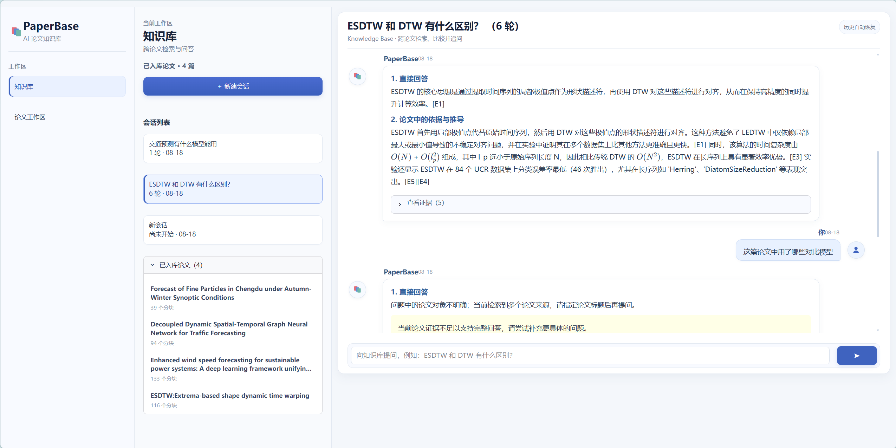
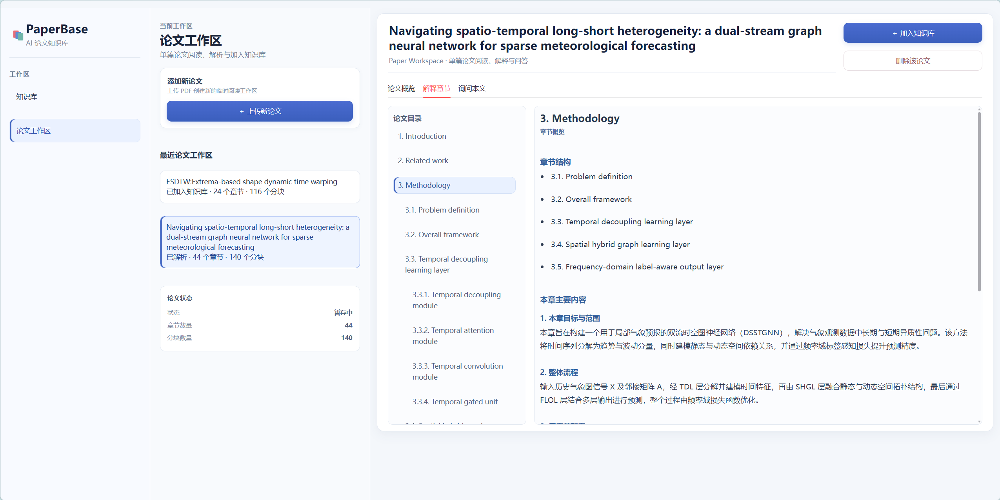
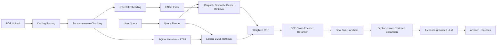

<div align="center">

# 📚 PaperBase

### 面向学术论文的 RAG 知识库与 AI 阅读辅助系统

**Scientific PDF Parsing · Hybrid Retrieval · Reranking · Evidence Expansion · Grounded QA · Evaluation**

<br/>


<br/>

[项目简介](#-项目简介) ·
[核心能力](#-核心能力) ·
[系统架构](#-系统架构) ·
[评测结果](#-评测结果) ·
[快速开始](#-快速开始) ·
[运行检查](#-运行检查) ·
[项目结构](#-项目结构) ·
[开发文档](docs/index.md) ·
[Roadmap](#-roadmap)

</div>

---

## ✨ 项目简介

**PaperBase** 是一个面向学术论文场景构建的 RAG 应用，覆盖从论文解析、结构化切片、索引构建，到混合检索、重排序、证据扩展和基于证据的答案生成的完整链路。

除了知识库问答，PaperBase 还提供 **Paper Overview、Explain Section、Ask This Paper** 等论文阅读辅助能力，并构建了独立的 **Golden Dataset + Retrieval Evaluation Pipeline**，用于持续评估检索效果、定位失败阶段和验证系统优化是否有效。

> **项目目标：** 不只是“让 RAG 跑起来”，而是构建一套能够被测试、分析、解释和持续优化的论文知识库系统。

<!--
如需展示 UI，可将截图放入 docs/assets/ 后取消下面注释。
-->
<p align="center">
  
  
</p>


---

## 🌟 核心能力

| 能力 | 实现 |
|---|---|
| **Scientific PDF Parsing** | 基于 **Docling** 解析论文标题、作者、章节结构、正文、表格与参考文献 |
| **Structure-aware Chunking** | 根据 Section Tree 与语义边界切片，并保留 `paper_id / section / page` 等 metadata |
| **Hybrid Retrieval** | **Qwen3 Embedding + FAISS** 负责语义召回，**SQLite FTS5 / BM25** 补充术语和关键词召回 |
| **Query Enrichment** | LLM Semantic Rewrite + Deterministic Lexical Extraction，多路检索同时保留原始 Query |
| **Weighted RRF** | 使用加权 Reciprocal Rank Fusion 融合 Dense / Sparse 多路候选 |
| **Cross-Encoder Reranking** | 使用 **BAAI/bge-reranker-v2-m3** 对候选 Evidence 精排 |
| **Evidence Expansion** | 对 Final Top-K anchors 做 section-aware 上下文扩展，缓解 Chunk Fragmentation |
| **Bibliography-aware Retrieval** | 正文与 References 分离管理，仅在 Bibliography Intent 下触发参考文献检索 |
| **Evidence-grounded QA** | LLM 仅基于检索 Evidence 生成回答，并保留来源证据 |
| **Paper Reading Workspace** | 支持 **Overview / Explain Section / Ask This Paper** 等论文阅读辅助功能 |
| **Evaluation Pipeline** | Golden Dataset、Stage Comparison、Slice Evaluation、Query Planner Audit、Expansion-aware Evaluation |

---

## 🧠 系统架构



### Retrieval Pipeline

```text
User Query
   │
   ├── Original Query
   │     └── Qwen3 Embedding → FAISS
   │
   └── Query Planner
         ├── Semantic Query → Dense Retrieval
         └── Lexical Terms  → SQLite FTS5 / BM25
                         │
                         ▼
                  Weighted RRF
                         │
                         ▼
                Candidate Top-K
                         │
                         ▼
              BGE Cross-Encoder
                         │
                         ▼
                  Final Top-5
                         │
                         ▼
             Evidence Expansion
                         │
                         ▼
                Answer Generation
```

正文、Bibliography 与论文 Metadata 分开管理。普通问题主要在正文索引中检索；只有在识别到参考文献查询意图时，才额外进入 Bibliography Retrieval。

---

## 🛠️ 技术栈

| Layer | Technology |
|---|---|
| PDF Parsing | Docling |
| Embedding | Qwen3-Embedding-0.6B |
| Vector Retrieval | FAISS |
| Sparse Retrieval | SQLite FTS5 / BM25 |
| Retrieval Fusion | Weighted RRF |
| Reranking | BAAI/bge-reranker-v2-m3 |
| Metadata / Storage | SQLite |
| LLM | OpenAI-compatible API |
| Frontend | Streamlit |
| Evaluation | Golden Dataset + Custom Evaluation Pipeline |
| Language | Python 3.10 |

---

## 📊 评测结果

PaperBase 使用人工审核后的 **40-case Golden Dataset** 对当前 **Context-free Knowledge Base Retrieval** 进行评测。

评测集包括：

- **32** 条正文 Answerable Query
- **4** 条 Bibliography Query
- **4** 条 Unanswerable Query

### Overall Retrieval

| Metric | Score |
|---|---:|
| **Hit@5** | **0.9375** |
| **Recall@5** | **0.8594** |
| **MRR@5** | **0.7156** |
| **Expanded Evidence Hit** | **0.9688** |
| **Expanded Evidence Recall** | **0.9323** |
| **Bibliography Hit@5** | **1.0000** |

Evidence Expansion 将整体 Evidence Recall 从 **85.94% → 93.23%**。

其中 Method 类 Query 的 Recall 从 **68.75% → 91.67%**，说明 section-aware expansion 能有效缓解方法描述被切分到相邻 chunks 后造成的证据碎片化。

### Retrieval Stage Comparison

| Stage | Hit@5 | Recall@5 | Hit@20 | Recall@20 | MRR@20 |
|---|---:|---:|---:|---:|---:|
| Original Dense | 0.7813 | 0.7188 | 0.9688 | 0.9063 | 0.5879 |
| RRF Fusion | 0.8125 | 0.7344 | **1.0000** | 0.9281 | 0.5136 |
| Reranker | **0.9375** | **0.8594** | **1.0000** | **0.9500** | **0.7234** |

> 当前评测主要用于 **工程回归、组件比较与失败定位**，不作为大规模通用 Benchmark 结论。

更完整的 Evaluation Design、Golden Dataset 与实验结果位于：

```text
eval/
├── candidates/
├── datasets/
├── scripts/
└── results/       # 本地生成，不提交到 Git
```

评测代码与数据说明见 [`eval/README.md`](eval/README.md)。论文 PDF、SQLite、FAISS、
模型权重和逐次运行结果均属于本地工件，不随仓库发布。

---

## 🔬 Evaluation Pipeline

PaperBase 不只记录最终 Hit / Recall，还保存各阶段完整 Trace：

```text
Original Dense
      ↓
Semantic / Lexical Retrieval
      ↓
RRF Fusion
      ↓
Reranker
      ↓
Final Top-5
      ↓
Evidence Expansion
```

支持的分析包括：

- Hit@K / Recall@K / MRR
- Retrieval Stage Comparison
- Fact / Method / Experiment / Result / Synthesis Slice
- Single-hop / Multi-hop Slice
- Bibliography Intent & Hit@5
- Cross-paper Candidate Noise
- Query Planner Audit
- Reranker Before / After Analysis
- Evidence Expansion Recovery
- Retrieval / Expansion Latency

Case-level Trace 可以进一步区分：

```text
retrieval_miss
ranking_failure
reranker_drop
expansion_recovered
post_expansion_incomplete
```

从而判断问题究竟发生在 **召回、融合、排序还是 Evidence Construction** 阶段。

---

## 🚀 快速开始

### 0. 环境要求

当前主开发与回归环境为 **Windows + PowerShell + Python 3.10 + NVIDIA CUDA**。
CPU 也可以运行，但 PDF 解析、Embedding 与 Reranker 会明显更慢。

开始前请准备：

- Git 与 Python 3.10
- 可用的 OpenAI-compatible LLM API
- 约数 GB 本地磁盘空间用于 Docling、Embedding 与 Reranker 模型
- 可选：NVIDIA GPU 与匹配的 CUDA 版 PyTorch

> 仓库不包含模型权重、论文 PDF、API Key、SQLite 数据库或 FAISS 索引。

### 1. Clone 仓库

```bash
git clone https://github.com/violet0711jiuy/PaperBase.git
cd PaperBase
```

### 2. 创建虚拟环境并安装 PyTorch

Windows / PowerShell：

```powershell
python -m venv .venv
.\.venv\Scripts\Activate.ps1
python -m pip install --upgrade pip
```

PyTorch 与机器的 CPU / CUDA 环境相关，因此没有固定写入 `requirements.txt`。
请先使用 [PyTorch 官方安装选择器](https://pytorch.org/get-started/locally/) 获取匹配命令。
仅使用 CPU 时可以先执行：

```powershell
python -m pip install torch
```

安装后确认 PyTorch 可用：

```powershell
python -c "import torch; print(torch.__version__); print('CUDA:', torch.cuda.is_available())"
```

### 3. 安装项目依赖

```powershell
python -m pip install -r requirements.txt
```

当前已回归验证的核心版本为：

```text
Python 3.10.4
Docling 2.119.0
FAISS 1.15.0
Sentence Transformers 5.7.0
Streamlit 1.61.1
```

### 4. 下载本地模型

项目以离线方式加载模型，不会在查询时自动下载。下面的目录与
`config.example.yaml` 默认值一致：

```powershell
hf download Qwen/Qwen3-Embedding-0.6B --local-dir models/Qwen3-Embedding-0.6B
hf download BAAI/bge-reranker-v2-m3 --local-dir models/bge-reranker-v2-m3
docling-tools models download --output-dir models/docling
```

如果 Hugging Face 模型需要鉴权，可先执行 `hf auth login`。`models/` 已加入
`.gitignore`，不会被提交。

### 5. 创建本地配置

复制环境变量与运行配置模板：

```powershell
Copy-Item .env.example .env
Copy-Item config.example.yaml config.yaml
```

在 `.env` 中填写 LLM 服务：

```dotenv
LLM_API_KEY=你的密钥
LLM_BASE_URL=OpenAI-compatible API 地址
LLM_MODEL=模型名称
```

模板默认使用 ModelScope 的 OpenAI-compatible 接口，也可以替换为其他兼容服务。
不要把真实密钥写入 `.env.example`、YAML、测试或文档。

`config.example.yaml` 中的三个模型目录已经对应上一步的下载位置。如果使用其他目录，
请在本地 `config.yaml` 中修改：

```text
parsing.docling.artifacts_path
chunking.tokenizer_path
embedding.model_path
reranking.model_path
```

没有 CUDA 时，还需要把以下设备配置改为 `cpu`：

```text
parsing.docling.device
embedding.device
reranking.device
```

`.env` 和 `config.yaml` 均不会提交到 Git。完整字段说明见
[`docs/configuration.md`](docs/configuration.md)。

### 6. 检查配置与 LLM

```powershell
python -c "from paperbase.config import load_settings; print(load_settings())"
python -m paperbase.llm.healthcheck --config .\config.yaml
```

第二条命令会发送一次最小 LLM 请求；失败时应先检查 API Key、Base URL、模型名和网络，
再启动完整问答流程。

### 7. 建立知识库

推荐通过 UI 增量加入论文：

1. 先按下一节启动 Streamlit；
2. 进入 **Paper Workspace**，上传单个 PDF；
3. 解析完成后可先使用 Overview / Explain Section / Ask This Paper；
4. 点击 **加入知识库**，将该论文安全写入正式 SQLite 与 FAISS。

如果已经把一批 PDF 放入 `storage/papers/`，也可以执行一次 clean rebuild：

```powershell
python -m paperbase.rebuild --config .\config.yaml
python -m paperbase.indexing --config .\config.yaml --verify
```

Clean rebuild 会重新解析 `storage/papers/` 中的全部 PDF，并原子发布新的 SQLite、
Embedding 工件与 FAISS；不要用它替代日常单篇增量入库。

### 8. 启动应用

```powershell
streamlit run app/app.py
```

浏览器打开 Streamlit 提示的本地地址后：

- **Knowledge Base**：对已经加入正式知识库的论文提问；
- **Paper Workspace**：上传和阅读单篇临时论文，并决定是否加入正式库。

---

## ✅ 运行检查

### 单元与回归测试

```powershell
python -m pytest -q
```

测试不需要真实 LLM 请求或下载论文，但完整套件需要先安装 `requirements.txt` 中的依赖。

### 正式索引一致性

```powershell
python -m paperbase.indexing --config .\config.yaml --verify
```

### Retrieval Evaluation

仓库公开当前 40-case Golden Dataset 与确定性评测脚本。运行前必须先准备与
[`eval/README.md`](eval/README.md) 清单一致的论文，并建立对应的正式知识库：

```powershell
python eval\scripts\validate_golden_dataset.py
python eval\scripts\run_retrieval_eval.py
python eval\scripts\build_retrieval_diagnostic.py
python eval\scripts\build_query_planner_audit.py
```

报告会写入已忽略的 `eval/results/`，不会改写 Golden Dataset 或正式检索链路。

---

## 📁 项目结构

```text
PaperBase/
├── app/
│   ├── components/          # Streamlit 可复用组件
│   ├── pages/               # 页面
│   ├── services/            # UI Service Layer
│   ├── app.py               # Streamlit 入口
│   ├── state.py             # 前端状态管理
│   └── STREAMLIT_UI_GUIDE.md
│
├── paperbase/
│   ├── ask_paper/           # Ask This Paper
│   ├── chunking/            # Structure-aware Chunking
│   ├── conversations/       # 会话管理
│   ├── embedding/           # Embedding
│   ├── explain_section/     # Explain Section
│   ├── generation/          # Answer Generation
│   ├── indexing/            # FAISS / SQLite Index
│   ├── llm/                 # LLM Client
│   ├── overview/            # Paper Overview
│   ├── parsing/             # Docling Parsing
│   ├── promotion/           # Staging / Promotion
│   ├── prompts/             # Prompt Definitions
│   ├── reranking/           # Cross-Encoder Reranking
│   ├── retrieval/           # Hybrid Retrieval / RRF
│   ├── staging/             # Temporary Paper Processing
│   ├── answer.py
│   ├── config.py
│   ├── database.py
│   └── rebuild.py
│
├── eval/
│   ├── candidates/          # Candidate Golden + 人工审核
│   ├── datasets/            # Reviewed Golden Dataset
│   ├── results/             # 本地 Evaluation Results（Git ignored）
│   └── scripts/             # Evaluation Scripts
│
├── docs/
│   ├── index.md             # 文档索引与维护规则
│   ├── configuration.md
│   ├── pipeline/            # 当前解析、存储、检索与生成设计
│   ├── evaluation/          # Evaluation Design 与当前 Baseline
│   └── roadmap/             # 明确标记为未实现的后续规划
│
├── storage/                 # Local Index / Runtime Data
├── tests/                   # Unit & Regression Tests
├── tmp/                     # Ignored temporary workspaces / retry artifacts
│
├── .env.example
├── .gitignore
├── config.example.yaml      # 可提交的运行配置模板
├── requirements.txt
└── README.md
```

---

## 💡 关键设计决策

<details>
<summary><b>为什么采用 Hybrid Retrieval？</b></summary>

<br/>

Dense Retrieval 更适合语义匹配，但论文问答中还大量存在模型名、缩写、年份、指标和专业术语等 lexical signals。

因此 PaperBase 同时使用：

```text
Dense Retrieval
+
BM25 / FTS5
```

并通过 Weighted RRF 融合两类结果。

</details>

<details>
<summary><b>为什么使用专用 Cross-Encoder Reranker？</b></summary>

<br/>

相比直接调用 LLM 对候选 Chunk 打分，专用 Reranker：

- 推理成本更低
- 输出更稳定
- 更适合批量 Candidate Ranking

因此 PaperBase 使用 BGE Cross-Encoder 对融合后的候选 Evidence 进行精排。

</details>

<details>
<summary><b>为什么单独处理 Bibliography？</b></summary>

<br/>

References 中包含大量论文题名、作者和专业术语。如果直接参与普通正文召回，容易产生高 lexical similarity 的噪声。

因此 PaperBase 将 Bibliography 与正文分开管理，仅在识别到引用查询意图时触发 References Retrieval。

</details>

<details>
<summary><b>为什么需要 Evidence Expansion？</b></summary>

<br/>

一个完整的方法、公式解释或实验设置经常会被 Chunk Boundary 拆成多个相邻 chunks。

因此 PaperBase 不直接将 Final Top-5 原样交给 LLM，而是在 Ranking 后执行 section-aware expansion，再构造最终 Evidence Context。

</details>

---

## ⚠️ 当前限制

当前系统对事实、实验设置和结果类 Query 的检索已经较稳定，但复杂问题仍有进一步优化空间：

- Multi-hop Query 的 Evidence Coverage 仍低于 Single-hop
- Synthesis Query 往往需要跨 Section 组合多个 Evidence
- 当前 Golden Dataset 规模较小，主要服务于工程回归与组件比较
- Query Planner 对复杂 multi-facet Query 仍有进一步优化空间
- 当前公开基线依赖 4 篇外部论文；仓库不重新分发其 PDF

---

## 🗺️ Roadmap

- [ ] Retrieval Ablation Study
- [ ] Multi-facet / Multi-query Retrieval
- [ ] Query Decomposition for complex synthesis questions
- [ ] Answer Generation Evaluation
- [ ] Faithfulness / Completeness / Citation Evaluation
- [ ] Larger Golden Dataset
- [ ] UI / UX Refinement

---

## 📌 项目定位

PaperBase 是一个面向 **AI Application Engineering / RAG Engineering** 的实践项目，重点覆盖：

```text
Document Understanding
        ↓
Retrieval
        ↓
Reranking
        ↓
Evidence Construction
        ↓
Generation
        ↓
Evaluation
```

核心关注点不是单纯调用 LLM，而是围绕 **检索质量、证据完整性、失败归因和可评测性** 构建完整的论文 RAG 系统。

---

## 📄 许可说明

当前仓库尚未附带开源许可证。公开可见不等同于自动授予复制、修改或再分发权；如果计划
将 PaperBase 作为正式开源项目发布，需要由项目所有者明确选择并加入 LICENSE。

---

<div align="center">

**PaperBase · Build RAG systems that can be measured, analyzed and improved.**

</div>
